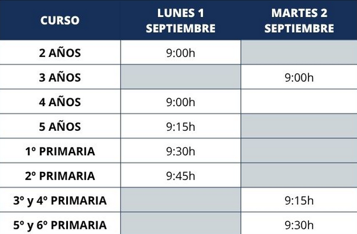

# Manual de Markdown (h1)

## Encabezados (h2)
### Encabezados (h3)


Esto es un párrafo  
Para saltar de linea, dos espacios en blanco  

### Listas Desordenadas
- Elemento 1
- Elemento 2

### Listas Ordenadas
---
1. Elemento *principal*
2. Elemento **secundario**
3. Lo que ***sea***
4. Elementos ``anidados``
    1. Yo estoy anidado
    2. Y yo tambien
5. Yo soy el último elemento
   

>Para previsualizar, usar comando CNTL+K, sueltas y luevo V Párrafo destacado importante Párrafo destacado importante Párrafo destacado importante Párrafo destacado importante Párrafo destacado importante Párrafo destacado importante Párrafo destacado importante Párrafo destacado importante Párrafo destacado importante Párrafo destacado importante 

Este es un enlace a la web de [Joyfe](https://joyfe.iepgroup.es/)

**Ejemplo de imagen incrustada**  


```html
<!DOCTYPE html>
<html lang="es">
<head>
  <meta charset="UTF-8">
  <title>Página Simple</title>
  <style>
    body {
      font-family: Arial, sans-serif;
      background-color: #f0f0f0;
      text-align: center;
      padding: 50px;
    }
    h1 {
      color: #333;
    }
    p {
      color: #555;
    }
    a {
      text-decoration: none;
      color: #007bff;
    }
    a:hover {
      text-decoration: underline;
    }
  </style>
</head>
<body>
  <h1>¡Hola, mundo!</h1>
  <p>Esta es una página HTML muy simple.</p>
  <a href="https://www.google.com" target="_blank">Ir a Google</a>
</body>
</html>
```

## Ejemplo de Tabla (Alt+Shift+F, para ordenar)

| Clasificación | Equipos     |
| :-----------: | ----------- |
|       1       | Real Madrid |
|       2       | Oviedo      |
|       3       | Getafe      |
|       4       | Rayo        |

- [X] Hombre  
- [ ] Mujer  
- [ ] Empresa  

